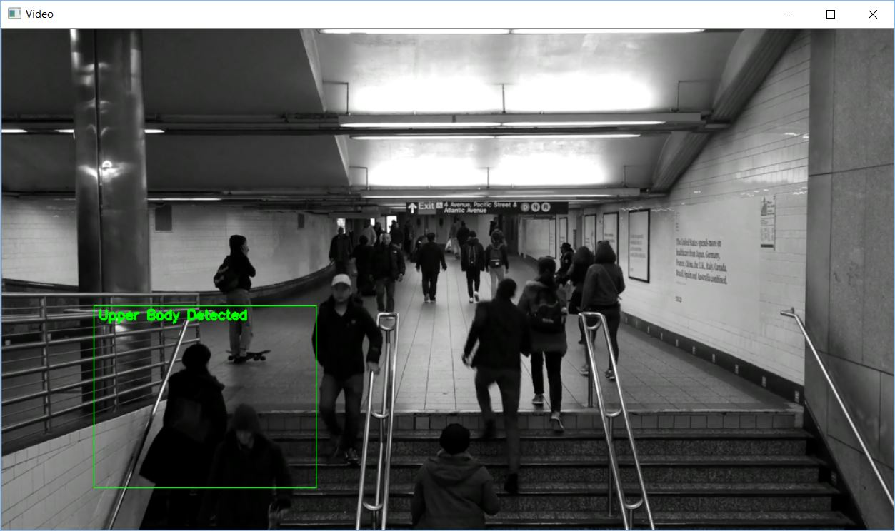
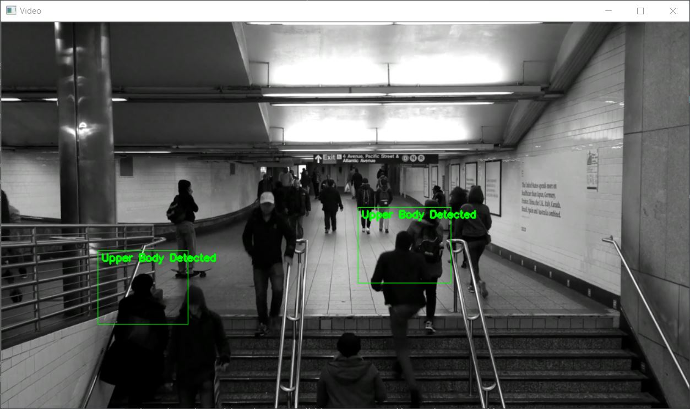

# Gerçek zamanlı insan vücudu üst bölge algılma
Gerçek zamanlı olarak insan gövdelerini algılayan python betiği.

## Nasıl çalışıyor
OpenCV's upperbody Haar Cascade verisini kullanarak insan vücudunun üst kısmını posiitive olara video kaynağı yada webcam üzerinden yakalar.
Positive yakalandığında yakalanan positive değer alanı yeşil bir dikdörtgen içine alınacak.
Birden fazla insan nesnesi çoklu dörtgen kutucuklar içine alınacaktır.




## Gereksinimler
* [Python](https://www.python.org/downloads/)
* [OpenCV-Python](https://pypi.python.org/pypi/opencv-python)
* [imutils](https://pypi.python.org/pypi/imutils)

## Video Kaynağı
[Pexels Videos](https://videos.pexels.com/videos/black-and-white-footage-of-train-station-2655)

## Başlangıç olarak
### Öngereksinimler
Başlamadan önce Python ve python için opencv-python ile imutils modülleri kurulmuş olmalı.

### Betiğin çalıştırılması
Herhangi bir terminal ekranında iken aşağıdaki komutu yazıp ENTER(RETURN) tuşuna basın.
```
python gercek_zamanli_govde_yakalama.py
```
